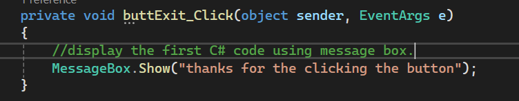
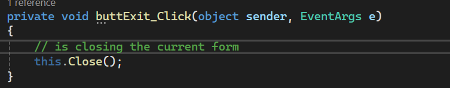
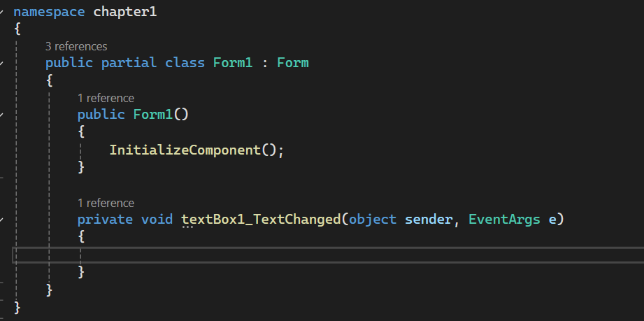

## 1 display a message using 'messageBox.show'
MessageBox.Show() is a C# method used to display a message to the user in a pop-up window.

## How It Works

1. The user clicks the button.
2. The Click event occurs.
3. The event handler runs.
4. MessageBox.Show() displays the message.

private void messageButton_Click(object sender, EventArgs e)  
{  
    MessageBox.Show("Hello World");  
} 

 
## 2 closing confirmation 
A MessageBox can also ask the user for confirmation before closing the form.

### How It Works

1. The user clicks the Exit button.
2. A confirmation message appears.
3. The user chooses Yes or No.
4. If Yes is selected, the form closes.
5. If No is selected, the form remains open.

private void exitButton_Click(object sender, EventArgs e)  
{  
    this.Close();  
}

### 3 how organize C#
Form1.cs is the C# source code file that contains the code and event handlers for the Form1 Windows Form.

It is used to control what happens when the user interacts with controls such as buttons, labels, and text boxes.

Basic Structure
namespace MyApplication  
{  
    public class Form1  
    {  
        public void DisplayMessage()  
        {  
           ///////////////////////////  
        }  
    }  
}

