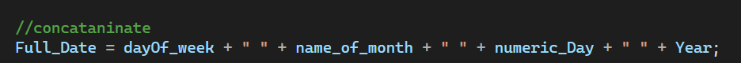
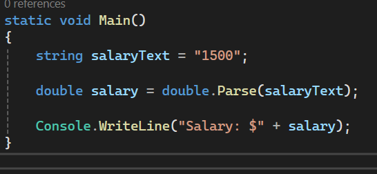

# Chapter 2: Three Important Codes

**Course:** C# Practice  
**Book:** Starting Out with Visual C# (6th Edition) by Tony Gaddis

---

## Code 1: String Concatenation


```csharp
private void showNameButton_Click(object sender, EventArgs e)
{
    string fullName;
    fullName = firstNameTextBox.Text + " " + lastNameTextBox.Text;
    fullNameLabel.Text = fullName;
}
```

**Explanation:**
Concatenation means joining strings with the `+` operator. This code joins the first name, a space, and the last name, and shows the result in a Label. For example, `Mohamed` and `Abdullahi` become `Mohamed Abdullahi`.

<br>




---

## Code 2: Parse and ToString


```csharp
private void calculateButton_Click(object sender, EventArgs e)
{
    int hoursWorked = int.Parse(hoursWorkedTextBox.Text);
    decimal payRate = decimal.Parse(payRateTextBox.Text);

    decimal grossPay = hoursWorked * payRate;

    grossPayLabel.Text = grossPay.ToString("c");
}
```

**Explanation:**
A TextBox always gives a string, so we use `int.Parse` and `decimal.Parse` to convert it to numbers before calculating. After the calculation, `ToString("c")` converts the number back to a currency string so the Label can show it. For example, 40 hours × 28.75 = `$1,150.00`.



<br>

---

## Code 3: try-catch

```csharp
private void calculateButton_Click(object sender, EventArgs e)
{
    try
    {
        double miles = double.Parse(milesTextBox.Text);
        double gallons = double.Parse(gallonsTextBox.Text);
        double mpg = miles / gallons;

        mpgLabel.Text = mpg.ToString();
    }
    catch (Exception ex)
    {
        MessageBox.Show(ex.Message);
    }
}
```

**Explanation:**
Code that may cause an error goes inside `try`. If the user types something that is not a number, `Parse` throws an exception, and the program jumps to `catch` and shows the error message. This way the program does not crash.


<br>

---

## Summary

| Code | Purpose |
|------|---------|
| Concatenation | Join strings with `+` |
| Parse and ToString | Convert between string and number |
| try-catch | Handle errors without crashing |